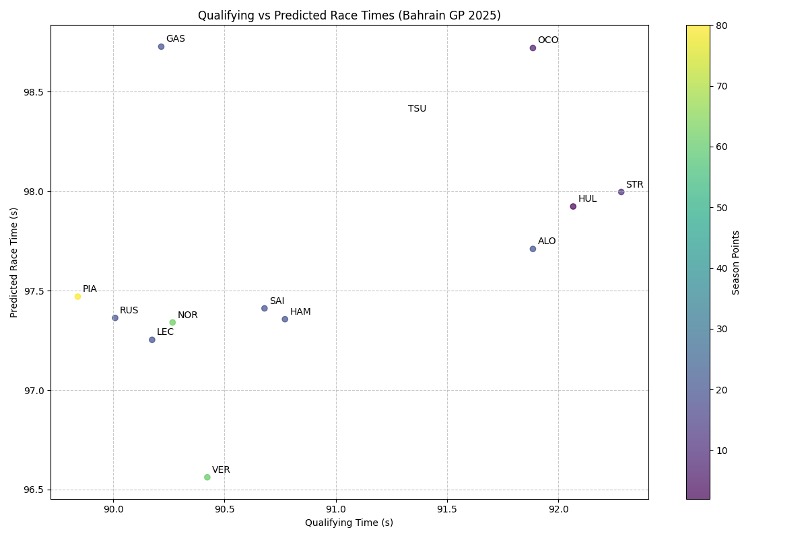
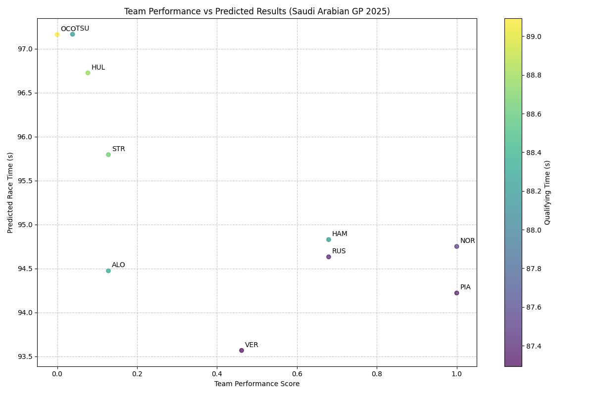

# 🏎️ F1 2025 Winner Predictor

<div align="center">
  
</div>

## 🌟 Overview

The **F1 2025 Winner Predictor** is a comprehensive machine learning platform designed to predict Formula 1 race winners with high accuracy. Built using advanced statistical models and real-time F1 data, this project combines multiple prediction algorithms to provide insights into driver and team performance throughout the 2025 F1 season.

## ✨ Key Features

### 🤖 **Advanced Prediction Models**
- **8 Specialized Models** - Each focusing on different aspects of race prediction
- **Multi-Algorithm Approach** - Combines statistical analysis, machine learning, and historical data
- **Real-time Data Integration** - Uses FastF1 API for live race data and telemetry
- **Performance Optimization** - Models continuously improve with new race data

### 📊 **Interactive Visualizations**
- **Performance Charts** - Team and driver comparative analysis
- **Race Predictions** - Visual representation of prediction confidence
- **Historical Trends** - Season-long performance tracking
- **Interactive Dashboards** - Built with Streamlit for intuitive user experience

### 🚀 **Technical Excellence**
- **Streamlit Web Application** - User-friendly interface
- **Efficient Caching** - Fast data retrieval and processing
- **Modular Architecture** - Easy to extend and maintain
- **Real-time Updates** - Live prediction updates during race weekends

## Usage

### Prerequisites

- **Python 3.8+**
- **Streamlit**

### Setup Instructions

1. **Clone the Repository**
   ```bash
   git clone https://github.com/LokeshChowdary05/F1-2025_Winner-Predictor.git
   cd F1-2025_Winner-Predictor
   ```

2. **Create Virtual Environment**
   ```bash
   python -m venv venv
   ```

3. **Activate the Environment**
   - **Windows**: `venv\Scripts\activate`
   - **Mac/Linux**: `source venv/bin/activate`

4. **Install Dependencies**
   ```bash
   pip install -r requirements.txt
   ```

5. **Run the Application**
   ```bash
   streamlit run app.py
   ```
   The application will open in your default browser at: `http://localhost:8501`

## 📈 Prediction Models

Our prediction system utilizes 8 specialized models, each designed to capture different aspects of F1 race dynamics:

### 🎯 **Model Portfolio**

| Model | Focus Area | Key Features |
|-------|------------|-------------|
| **prediction1.py** | Basic Predictions | Fundamental race winner analysis |
| **prediction2.py** | Driver Changes | Accounts for driver lineup changes |
| **prediction2_nochange.py** | Stable Lineups | Predictions without driver changes |
| **prediction2_olddrivers.py** | Veteran Analysis | Focus on experienced drivers |
| **prediction3.py** | Statistical Model | Advanced statistical algorithms |
| **prediction4.py** | Team Performance | Comprehensive team analysis |
| **prediction5.py** | Enhanced Accuracy | Optimized prediction algorithms |
| **prediction6.py** | Race-Specific | Circuit-specific predictions |
| **prediction7.py** | Driver Metrics | Individual driver performance |
| **prediction8.py** | Final Model | Most accurate optimized model |

### 🛠️ **Core Components**

- **prediction_functions.py** - Shared utilities and helper functions
- **Data Processing** - Real-time F1 data integration via FastF1
- **Caching System** - Efficient data storage and retrieval
- **Visualization Engine** - Performance charts and analysis

## 📊 Results & Visualization

### 🏆 **Performance Analytics**

<div align="center">
  
  <p><em>Bahrain Grand Prix Performance Analysis - Driver and team performance metrics</em></p>
</div>

<div align="center">
  
  <p><em>Comprehensive Team Performance Comparison Across the Season</em></p>
</div>

### 📝 **Key Insights**

- **Driver Performance Trends** - Track individual driver progress throughout the season
- **Team Dynamics** - Analyze team strategies and performance patterns
- **Circuit Analysis** - Understand how different tracks affect performance
- **Prediction Accuracy** - Monitor and improve model performance over time

## 🚀 Technical Architecture

### 💻 **Technology Stack**

- **Frontend**: Streamlit Web Application
- **Backend**: Python with FastF1 API integration
- **Data Processing**: Pandas, NumPy
- **Visualization**: Matplotlib, Plotly
- **Machine Learning**: Scikit-learn, Statistical Models
- **Caching**: SQLite database for efficient data storage

### 🏗️ **Project Structure**

```
F1-2025_Winner-Predictor/
├── app.py                          # Main Streamlit application
├── prediction1.py                 # Basic prediction model
├── prediction2.py                 # Enhanced prediction model
├── prediction3.py                 # Statistical model
├── prediction4.py                 # Team performance model
├── prediction5.py                 # Advanced model
├── prediction6.py                 # Race-specific model
├── prediction7.py                 # Driver metrics model
├── prediction8.py                 # Optimized final model
├── prediction_functions.py        # Shared utilities
├── requirements.txt               # Python dependencies
├── bahrain_performance.png        # Performance visualization
├── team_performance.png           # Team comparison chart
└── README.md                      # Project documentation
```

## 🗺️ Roadmap

### 🎯 **Current Features**
- ✅ Multiple prediction models
- ✅ Interactive web interface
- ✅ Performance visualizations
- ✅ Real-time data integration

### 🚀 **Upcoming Features**
- 🔄 Live race predictions during GP weekends
- 📱 Mobile-responsive design
- 🤖 AI-powered prediction confidence scoring
- 📊 Advanced analytics dashboard
- 🏆 Season championship predictions

## Contributing

Contributions welcome! Feel free to submit pull requests or open issues.

## License

This project is licensed under the MIT License - see the LICENSE file for details.

## Contact

Created by Lokesh Chowdary. Reach out for collaboration or queries.

